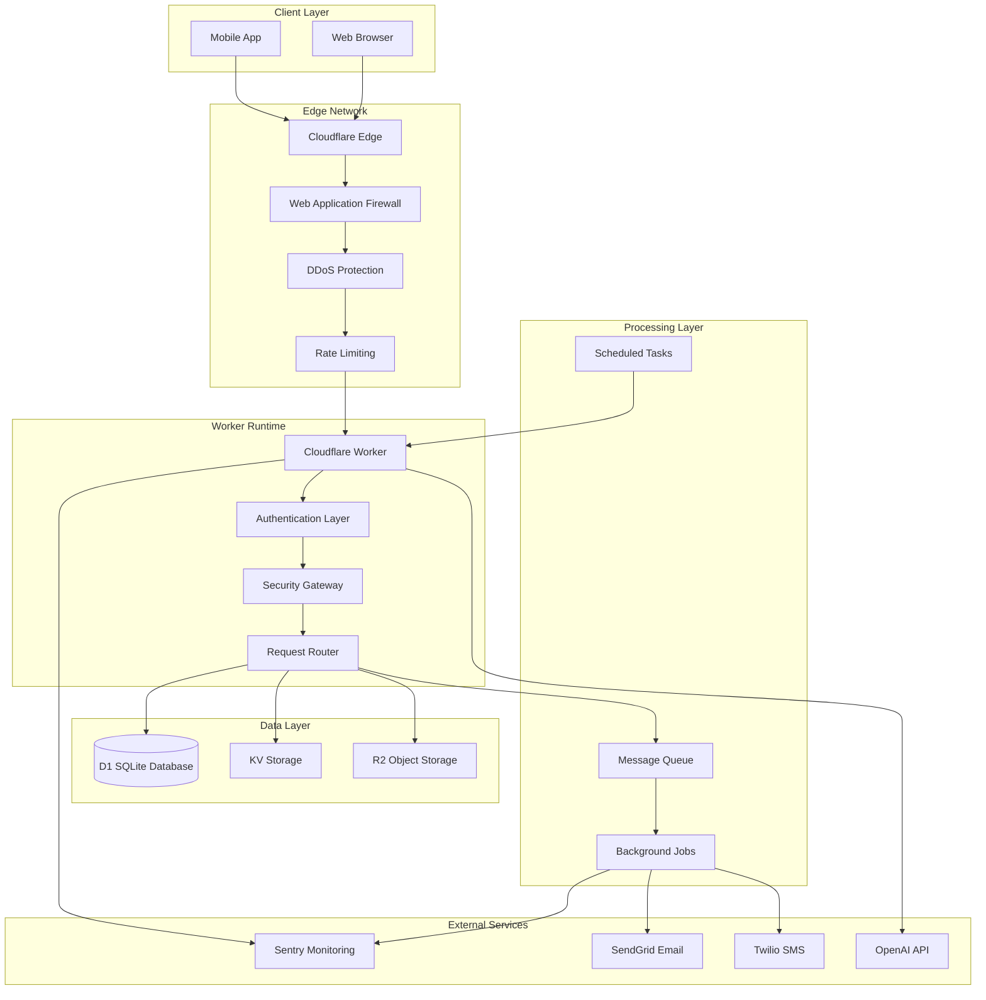
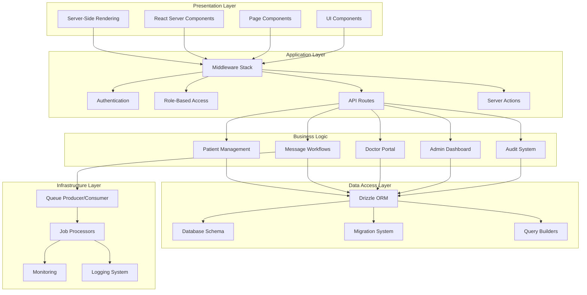
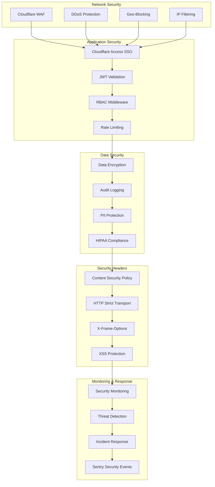
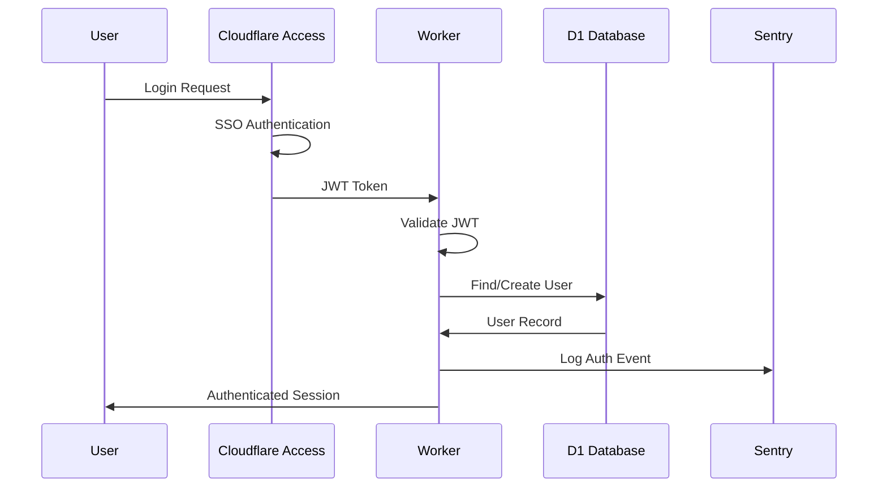
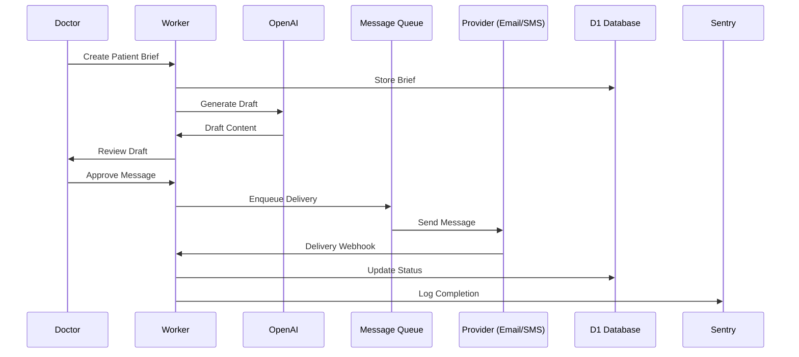
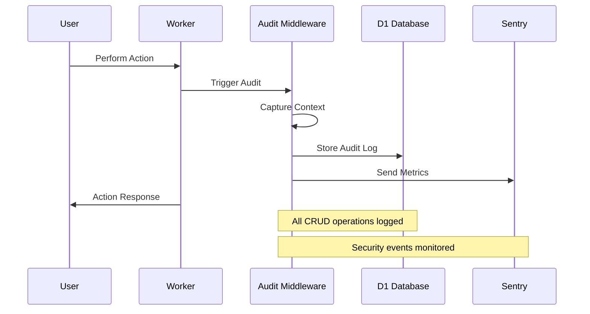
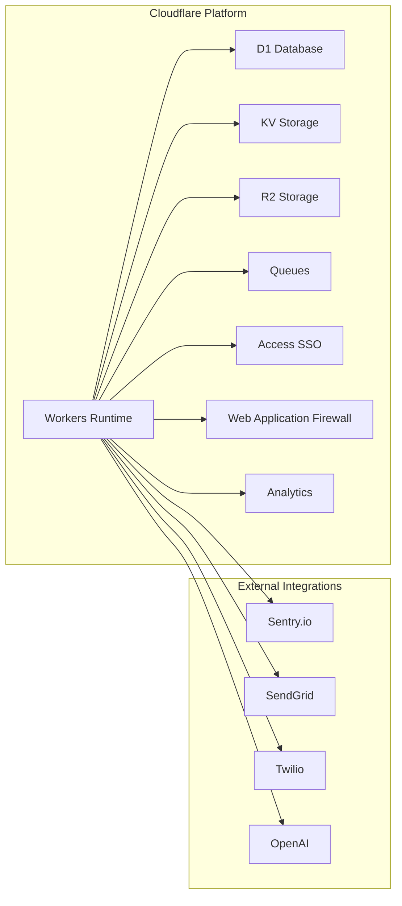
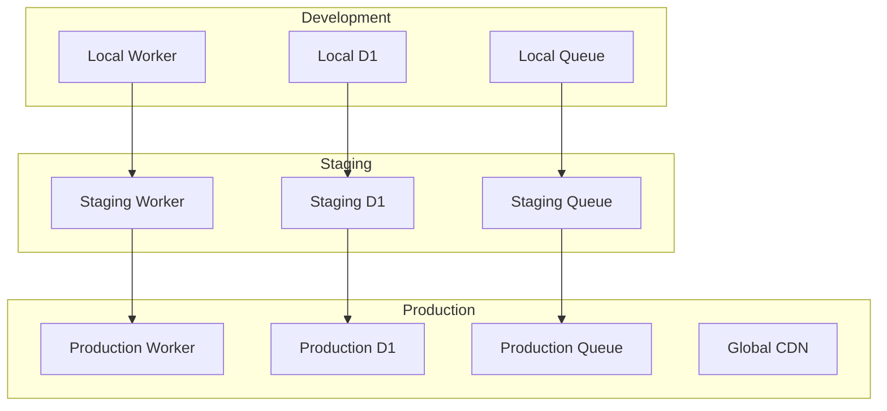
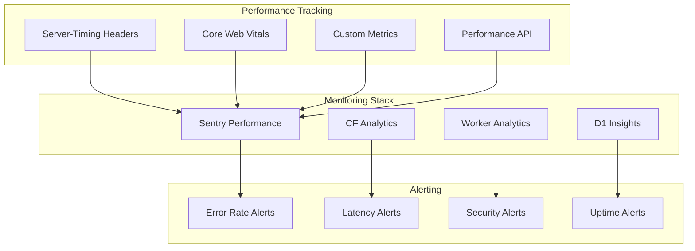

# RedwoodSDK Cloudflare Architecture Documentation

## Table of Contents
- [Overview](#overview)
- [System Architecture](#system-architecture)
- [Component Architecture](#component-architecture)
- [Security Architecture](#security-architecture)
- [Data Flow](#data-flow)
- [Infrastructure](#infrastructure)
- [Performance & Monitoring](#performance--monitoring)
- [Technology Stack](#technology-stack)

## Overview

The RedwoodSDK Cloudflare Starter is a production-ready, edge-native healthcare communication platform built on Cloudflare's serverless infrastructure. The system provides secure, HIPAA-compliant patient communication workflows with sub-50ms response times globally.

### Key Features
- **Edge-Native SSR**: Server-side rendering at the edge with React Server Components
- **Zero-Trust Security**: Cloudflare Access SSO with RBAC and comprehensive security policies
- **Healthcare Compliance**: HIPAA-compliant audit trails and data handling
- **Global Scale**: Sub-50ms response times via Cloudflare's global network
- **Async Processing**: Queue-based message delivery with retry mechanisms
- **Comprehensive Monitoring**: Performance tracking, error monitoring, and observability

## System Architecture

## Component Architecture

## Security Architecture

## Data Flow

### Authentication Flow

### Message Workflow

### Audit Trail Flow

## Infrastructure

### Cloudflare Services Integration

### Environment Architecture

## Performance & Monitoring

### Performance Architecture

## Technology Stack

### Core Technologies
- **Runtime**: Cloudflare Workers (V8 JavaScript/TypeScript)
- **Framework**: RedwoodSDK (Server-Side Rendering)
- **Frontend**: React 18 + Server Components
- **Database**: Cloudflare D1 (SQLite) with Drizzle ORM
- **Authentication**: Cloudflare Access (Zero Trust SSO)
- **Queue System**: Cloudflare Queues
- **Storage**: Cloudflare KV + R2

### Development Tools
- **Build System**: Vite + Wrangler
- **Type Safety**: TypeScript + Strict Mode
- **Testing**: Vitest (Unit) + Playwright (E2E)
- **Development**: Dev Containers + Hot Reload
- **CI/CD**: GitHub Actions + Wrangler Deploy

### External Integrations
- **Monitoring**: Sentry.io (Errors + Performance)
- **Email**: SendGrid API
- **SMS**: Twilio API
- **AI**: OpenAI GPT-4 API
- **Analytics**: Cloudflare Analytics

### Security & Compliance
- **Security Headers**: CSP, HSTS, Frame Options
- **Rate Limiting**: KV-based with sliding windows
- **Audit Logging**: Comprehensive CRUD tracking
- **HIPAA Compliance**: Encrypted data handling
- **WAF Protection**: Cloudflare managed rules

## Key Performance Metrics

| Metric | Target | Monitoring |
|--------|--------|------------|
| First Response Time | < 50ms | Server-Timing headers |
| Database Query Time | < 10ms | D1 performance tracking |
| Queue Processing | < 5s | Sentry job monitoring |
| Error Rate | < 0.1% | Sentry error tracking |
| Uptime | > 99.9% | Cloudflare Analytics |
| Security Score | > 95% | Custom security metrics |

## Deployment Environments

| Environment | Purpose | Configuration |
|-------------|---------|---------------|
| **Local** | Development | Local D1, stub APIs, debug logging |
| **Dev** | Integration testing | Shared D1, real APIs, detailed logging |
| **Staging** | Pre-production | Production-like, reduced logging |
| **Production** | Live system | Optimized performance, minimal logging |

## Next Steps

For detailed implementation guides, see:
- [API Documentation](./API.md)
- [Deployment Guide](./DEPLOYMENT.md)
- [Operations Manual](./OPERATIONS.md)
- [Troubleshooting Guide](./TROUBLESHOOTING.md)
- [Security Procedures](./SECURITY.md)
