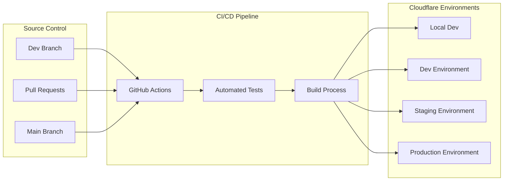
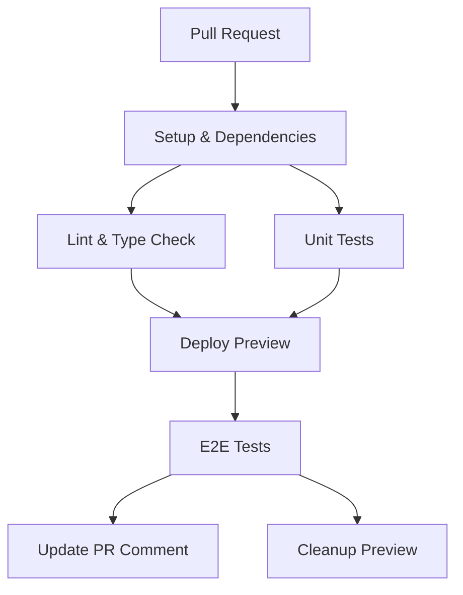
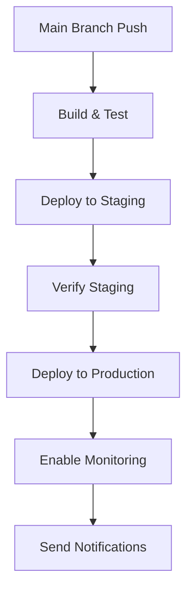

# Deployment Guide

## Table of Contents
- [Overview](#overview)
- [Prerequisites](#prerequisites)
- [Environment Setup](#environment-setup)
- [Local Development](#local-development)
- [Staging Deployment](#staging-deployment)
- [Production Deployment](#production-deployment)
- [CI/CD Pipeline](#cicd-pipeline)
- [Database Migrations](#database-migrations)
- [Secrets Management](#secrets-management)
- [Rollback Procedures](#rollback-procedures)
- [Troubleshooting](#troubleshooting)

## Overview

The RedwoodSDK Cloudflare application uses a multi-environment deployment strategy with automated CI/CD pipelines. Deployments are managed through GitHub Actions and Wrangler CLI.

### Deployment Environments
- **Local**: Development environment with local D1 database
- **Dev**: Shared development environment for integration testing
- **Staging**: Pre-production environment for final testing
- **Production**: Live production environment

### Deployment Architecture


## Prerequisites

### Required Tools
- **Node.js**: v18 or higher
- **pnpm**: v8 or higher
- **Wrangler CLI**: Latest version
- **Git**: For version control
- **Cloudflare Account**: With Workers and D1 access

### Installation
```bash
# Install Node.js (use nvm for version management)
curl -o- https://raw.githubusercontent.com/nvm-sh/nvm/v0.39.0/install.sh | bash
nvm install 18
nvm use 18

# Install pnpm
npm install -g pnpm@8

# Install Wrangler CLI
npm install -g wrangler

# Verify installations
node --version    # Should be v18+
pnpm --version    # Should be 8+
wrangler --version
```

### Cloudflare Account Setup
1. **Create Cloudflare Account**: Sign up at [cloudflare.com](https://cloudflare.com)
2. **Get Account ID**: Available in Cloudflare dashboard
3. **Generate API Token**: Create token with Workers and D1 permissions
4. **Enable Workers**: Ensure Workers plan is active

## Environment Setup

### Environment Variables

#### Required for All Environments
```bash
# Cloudflare Configuration
CLOUDFLARE_ACCOUNT_ID="your-account-id"
CLOUDFLARE_API_TOKEN="your-api-token"

# Application Configuration
ENVIRONMENT="local|dev|staging|prod"
SENTRY_DSN="your-sentry-dsn"
WEBHOOK_SECRET="secure-webhook-secret"

# Security Configuration
SECURITY_RATE_LIMIT_IP="100"
SECURITY_RATE_LIMIT_USER="500"
SECURITY_ENABLE_WAF="true"
SECURITY_DDOS_THRESHOLD="1000"
```

#### Production-Specific
```bash
# Cloudflare Access (Zero Trust SSO)
CLOUDFLARE_ACCESS_DOMAIN="your-domain.cloudflareaccess.com"
CLOUDFLARE_ACCESS_AUD="application-audience-id"

# External Services
SENDGRID_API_KEY="your-sendgrid-key"
TWILIO_ACCOUNT_SID="your-twilio-sid"
TWILIO_AUTH_TOKEN="your-twilio-token"
OPENAI_API_KEY="your-openai-key"

# Advanced Security
SECURITY_ENABLE_GEO_BLOCKING="true"
SECURITY_BLOCKED_COUNTRIES="CN,RU"
SECURITY_ANOMALY_THRESHOLD="50"
```

### Wrangler Configuration

The project uses environment-specific configurations in `wrangler.jsonc`:

```json
{
  "env": {
    "local": {
      "name": "ai-concierge-mvp-local",
      "vars": {
        "ENVIRONMENT": "local",
        "AI_STUB": "1",
        "DELIVERY_PROVIDER": "noop"
      }
    },
    "dev": {
      "name": "ai-concierge-mvp-dev",
      "vars": {
        "ENVIRONMENT": "dev"
      }
    },
    "staging": {
      "name": "ai-concierge-mvp-staging",
      "vars": {
        "ENVIRONMENT": "staging"
      }
    },
    "prod": {
      "name": "ai-concierge-mvp-prod",
      "vars": {
        "ENVIRONMENT": "prod"
      }
    }
  }
}
```

## Local Development

### Initial Setup
```bash
# Clone repository
git clone <repository-url>
cd my-app

# Install dependencies
pnpm install

# Copy environment template
cp .env.example .dev.vars

# Generate database migrations
pnpm dlx drizzle-kit generate

# Apply migrations to local database
wrangler d1 migrations apply concierge_dev --local --database ./dev.db

# Seed database (optional)
node --loader tsx scripts/seed.ts
```

### Development Server
```bash
# Start development server
CLOUDFLARE_ENV=local pnpm dev

# Server will be available at:
# http://localhost:5173
```

### Development Commands
```bash
# Type checking
pnpm types

# Run tests
pnpm test:unit
pnpm test:integration
pnpm test:e2e

# Database operations
pnpm db:generate     # Generate migrations
pnpm db:migrate:dev  # Apply migrations locally
pnpm db:seed         # Seed database

# Performance monitoring
pnpm perf:headers    # Check performance headers
pnpm perf:metrics    # Get performance metrics
```

### Local Database Management
```bash
# Create local database
wrangler d1 create concierge_local

# Apply migrations
wrangler d1 migrations apply concierge_local --local

# Execute SQL queries
wrangler d1 execute concierge_local --local --command "SELECT * FROM users;"

# View database schema
wrangler d1 execute concierge_local --local --command ".schema"
```

## Staging Deployment

### Prerequisites
- Completed local development and testing
- All tests passing
- Database migrations prepared

### Deployment Steps

#### 1. Prepare Staging Environment
```bash
# Create staging database
wrangler d1 create concierge_staging

# Update wrangler.jsonc with staging database ID
# Replace __REPLACE_WITH_STAGING_DB_ID__ with actual database ID

# Apply migrations to staging
wrangler d1 migrations apply concierge_staging --remote

# Seed staging database (if needed)
wrangler d1 execute concierge_staging --remote --file scripts/seed.sql
```

#### 2. Deploy to Staging
```bash
# Build application
pnpm build

# Deploy to staging environment
wrangler deploy --env staging

# Verify deployment
curl -I https://ai-concierge-mvp-staging.your-subdomain.workers.dev/health
```

#### 3. Staging Verification
```bash
# Run smoke tests
curl -H "Authorization: Bearer <staging-token>" \
     https://ai-concierge-mvp-staging.your-subdomain.workers.dev/debug/env

# Check database connection
curl -H "Authorization: Bearer <staging-token>" \
     https://ai-concierge-mvp-staging.your-subdomain.workers.dev/debug/db-health

# Verify queue functionality
curl -H "Authorization: Bearer <staging-token>" \
     https://ai-concierge-mvp-staging.your-subdomain.workers.dev/debug/queue-status
```

#### 4. Run E2E Tests
```bash
# Set staging URL for tests
export PLAYWRIGHT_BASE_URL="https://ai-concierge-mvp-staging.your-subdomain.workers.dev"

# Run end-to-end tests
pnpm e2e

# Check test results
echo "E2E tests completed. Check playwright-report/ for details."
```

## Production Deployment

### Pre-Deployment Checklist

#### Security Checklist
- [ ] All secrets properly configured
- [ ] Cloudflare Access SSO configured
- [ ] WAF rules enabled
- [ ] Rate limiting configured
- [ ] Security headers validated
- [ ] HTTPS enforcement enabled

#### Performance Checklist
- [ ] Bundle size within limits (<500KB per chunk)
- [ ] Performance budgets met
- [ ] Caching strategies configured
- [ ] CDN configuration optimized

#### Monitoring Checklist
- [ ] Sentry error tracking configured
- [ ] Performance monitoring enabled
- [ ] Uptime monitoring configured
- [ ] Alert rules configured

### Production Deployment Steps

#### 1. Create Production Environment
```bash
# Create production database
wrangler d1 create concierge_prod

# Create production KV namespaces
wrangler kv:namespace create "RATE_LIMITER" --env prod
wrangler kv:namespace create "SECURITY_BLOCKLIST" --env prod

# Update wrangler.jsonc with production IDs
# Replace all __REPLACE_WITH_PROD_*__ placeholders
```

#### 2. Configure Production Secrets
```bash
# Set production secrets
wrangler secret put OPENAI_API_KEY --env prod
wrangler secret put SENDGRID_API_KEY --env prod
wrangler secret put TWILIO_AUTH_TOKEN --env prod
wrangler secret put WEBHOOK_SECRET --env prod
wrangler secret put SENTRY_DSN --env prod

# Verify secrets are set
wrangler secret list --env prod
```

#### 3. Database Migration
```bash
# Backup existing production data (if upgrading)
wrangler d1 export concierge_prod --output backup-$(date +%Y%m%d).sql

# Apply new migrations
wrangler d1 migrations apply concierge_prod --remote

# Verify migration success
wrangler d1 execute concierge_prod --remote --command "SELECT COUNT(*) FROM users;"
```

#### 4. Deploy to Production
```bash
# Build production bundle
RWSDK_DEPLOY=1 pnpm build

# Deploy to production
wrangler deploy --env prod

# Upload source maps to Sentry (for error tracking)
pnpm sentry:upload-sourcemaps
```

#### 5. Production Verification
```bash
# Health check
curl -f https://ai-concierge-mvp-prod.your-subdomain.workers.dev/health

# Performance check
curl -w "@curl-format.txt" -s https://ai-concierge-mvp-prod.your-subdomain.workers.dev/

# Security headers check
curl -I https://ai-concierge-mvp-prod.your-subdomain.workers.dev/
```

#### 6. Post-Deployment Tasks

**Enable Monitoring**
```bash
# Check Sentry integration
curl -sS https://ai-concierge-mvp-prod.your-subdomain.workers.dev/debug/sentry

# Verify performance tracking
curl -sS https://ai-concierge-mvp-prod.your-subdomain.workers.dev/monitoring/performance
```

**Configure Alerts**
1. Set up Sentry alerts for error rates
2. Configure Cloudflare alerts for performance
3. Set up uptime monitoring
4. Configure security incident alerts

## CI/CD Pipeline

### GitHub Actions Workflow

The project uses automated CI/CD with the following stages:

#### Pull Request Workflow (`ci.yml`)


**Stages:**
1. **Setup**: Install dependencies, cache build artifacts
2. **Lint & Type Check**: Validate code quality
3. **Unit Tests**: Run test suite with coverage
4. **Deploy Preview**: Create preview environment
5. **E2E Tests**: Run end-to-end tests on preview
6. **Security Scan**: Check for vulnerabilities
7. **Comment PR**: Update PR with deployment status
8. **Cleanup**: Remove preview resources

#### Production Release Workflow (`release.yml`)


**Stages:**
1. **Build & Test**: Full test suite execution
2. **Deploy to Staging**: Automated staging deployment
3. **Verify Staging**: Smoke tests and validation
4. **Deploy to Production**: Production deployment
5. **Enable Monitoring**: Activate monitoring and alerts
6. **Send Notifications**: Team notifications

### GitHub Secrets Configuration

Required secrets in GitHub repository settings:

```bash
# Cloudflare Configuration
CLOUDFLARE_API_TOKEN="your-api-token"
CLOUDFLARE_ACCOUNT_ID="your-account-id"

# Production Secrets
PROD_OPENAI_API_KEY="production-openai-key"
PROD_SENDGRID_API_KEY="production-sendgrid-key"
PROD_TWILIO_AUTH_TOKEN="production-twilio-token"
PROD_SENTRY_DSN="production-sentry-dsn"
PROD_WEBHOOK_SECRET="production-webhook-secret"

# Access Control
PROD_CLOUDFLARE_ACCESS_DOMAIN="your-domain.cloudflareaccess.com"
PROD_CLOUDFLARE_ACCESS_AUD="application-audience-id"

# Notification Webhooks (optional)
SLACK_WEBHOOK_URL="https://hooks.slack.com/..."
TEAMS_WEBHOOK_URL="https://outlook.office.com/webhook/..."
```

### Automated Deployment Triggers

**Development Deployments:**
- Every push to `dev` branch
- Preview deployments for all pull requests
- Automatic cleanup of preview environments

**Staging Deployments:**
- Manual trigger from GitHub Actions
- Automated after successful dev testing
- Scheduled deployments for nightly builds

**Production Deployments:**
- Manual trigger only (for safety)
- Requires approval from designated team members
- Automated rollback on critical errors

## Database Migrations

### Migration Strategy

The application uses Drizzle ORM for database migrations with the following strategy:

1. **Development**: Use local SQLite database
2. **Staging/Production**: Use Cloudflare D1 databases
3. **Migration Files**: Stored in `drizzle/migrations/`
4. **Schema Changes**: Defined in `src/db/schema.ts`

### Creating Migrations
```bash
# Generate migration from schema changes
pnpm dlx drizzle-kit generate

# Review generated migration
ls drizzle/migrations/

# Test migration locally
wrangler d1 migrations apply concierge_dev --local

# Apply to staging
wrangler d1 migrations apply concierge_staging --remote

# Apply to production
wrangler d1 migrations apply concierge_prod --remote
```

### Migration Best Practices

1. **Backward Compatibility**: Ensure migrations don't break existing deployments
2. **Atomic Operations**: Keep migrations small and focused
3. **Rollback Plan**: Always have a rollback strategy
4. **Testing**: Test migrations in staging before production
5. **Backup**: Always backup before major schema changes

### Example Migration Process
```bash
# 1. Make schema changes
# Edit src/db/schema.ts

# 2. Generate migration
pnpm dlx drizzle-kit generate
# Creates: drizzle/migrations/0001_add_new_column.sql

# 3. Test locally
wrangler d1 migrations apply concierge_dev --local

# 4. Commit changes
git add drizzle/migrations/ src/db/schema.ts
git commit -m "Add new column for feature X"

# 5. Deploy to staging (CI/CD handles migration)
git push origin develop

# 6. Verify in staging
# Check application functionality

# 7. Deploy to production
# Manual deployment trigger with migration
```

## Secrets Management

### Secret Types

**Application Secrets:**
- OpenAI API key
- SendGrid API key
- Twilio credentials
- Webhook secrets
- Sentry DSN

**Infrastructure Secrets:**
- Cloudflare API tokens
- Database connection strings
- KV namespace IDs

**Authentication Secrets:**
- JWT signing keys
- Cloudflare Access configuration
- OAuth client secrets

### Setting Secrets

#### Wrangler CLI
```bash
# Set individual secrets
wrangler secret put OPENAI_API_KEY --env prod
wrangler secret put SENDGRID_API_KEY --env staging

# List existing secrets
wrangler secret list --env prod

# Delete secret
wrangler secret delete OLD_SECRET --env prod
```

#### Bulk Secret Management
```bash
# Create secrets file (DO NOT COMMIT)
cat > .secrets.env << EOF
OPENAI_API_KEY=sk-...
SENDGRID_API_KEY=SG...
TWILIO_AUTH_TOKEN=...
EOF

# Apply secrets from file
while IFS='=' read -r key value; do
  wrangler secret put "$key" --env prod <<< "$value"
done < .secrets.env

# Clean up secrets file
rm .secrets.env
```

### Secret Rotation

**Regular Rotation Schedule:**
- API keys: Every 90 days
- Webhook secrets: Every 60 days
- Access tokens: Every 30 days

**Rotation Process:**
1. Generate new secret in provider system
2. Update secret in staging environment
3. Test staging deployment
4. Update production secret
5. Verify production functionality
6. Revoke old secret in provider system

## Rollback Procedures

### Automatic Rollback Triggers

The deployment system automatically triggers rollbacks when:
- Error rate exceeds 5% for 5 minutes
- Response time exceeds 1000ms for 10 minutes
- Health checks fail for 3 consecutive attempts
- Critical security alerts are triggered

### Manual Rollback Process

#### Quick Rollback (Previous Version)
```bash
# Get previous deployment
wrangler deployments list --env prod

# Rollback to previous deployment
wrangler rollback <deployment-id> --env prod

# Verify rollback
curl -f https://ai-concierge-mvp-prod.your-subdomain.workers.dev/health
```

#### Specific Version Rollback
```bash
# Deploy specific version
git checkout <commit-hash>
RWSDK_DEPLOY=1 pnpm build
wrangler deploy --env prod

# Or use GitHub Actions
# Go to Actions → Release → Re-run specific workflow
```

#### Database Rollback
```bash
# Restore from backup
wrangler d1 import concierge_prod backup-20240101.sql

# Or rollback specific migration
wrangler d1 migrations apply concierge_prod --to <migration-number>
```

### Rollback Verification Checklist

- [ ] Application health check passes
- [ ] Authentication system functional
- [ ] Database queries working
- [ ] Queue processing active
- [ ] External integrations connected
- [ ] Monitoring systems active
- [ ] Error rates normalized

## Troubleshooting

### Common Deployment Issues

#### Build Failures
```bash
# Clear cache and rebuild
rm -rf node_modules .next dist
pnpm install
pnpm build

# Check for TypeScript errors
pnpm types

# Verify dependencies
pnpm audit --audit-level moderate
```

#### Database Connection Issues
```bash
# Check database binding
wrangler d1 list

# Test database connection
wrangler d1 execute concierge_prod --remote --command "SELECT 1;"

# Verify migrations
wrangler d1 migrations list concierge_prod
```

#### Secret Management Issues
```bash
# Verify secrets are set
wrangler secret list --env prod

# Test secret access
curl -H "Authorization: Bearer <test-token>" \
     https://ai-concierge-mvp-prod.your-subdomain.workers.dev/debug/env
```

#### Performance Issues
```bash
# Check bundle size
pnpm build
du -sh dist/

# Analyze performance
curl -w "@curl-format.txt" -s https://ai-concierge-mvp-prod.your-subdomain.workers.dev/

# Check Cloudflare Analytics
# Visit Cloudflare dashboard → Workers → Analytics
```

### Error Resolution

#### "Database not found" Error
1. Verify database exists: `wrangler d1 list`
2. Check wrangler.jsonc database binding
3. Ensure migrations are applied
4. Verify environment variables

#### "Authentication failed" Error
1. Check Cloudflare Access configuration
2. Verify JWT token validity
3. Check audience and issuer settings
4. Test with debug endpoint

#### "Rate limit exceeded" Error
1. Check current rate limit settings
2. Review KV namespace configuration
3. Verify rate limiting logic
4. Consider increasing limits

### Monitoring and Debugging

#### Health Checks
```bash
# Application health
curl -f https://ai-concierge-mvp-prod.your-subdomain.workers.dev/health

# Database health
curl -H "Authorization: Bearer <token>" \
     https://ai-concierge-mvp-prod.your-subdomain.workers.dev/debug/db-health

# Queue health
curl -H "Authorization: Bearer <token>" \
     https://ai-concierge-mvp-prod.your-subdomain.workers.dev/debug/queue-status
```

#### Log Analysis
```bash
# Tail worker logs
wrangler tail --env prod

# Filter specific errors
wrangler tail --env prod --grep "ERROR"

# Check Sentry for errors
# Visit Sentry dashboard for detailed error analysis
```

#### Performance Monitoring
```bash
# Get performance metrics
curl -H "Authorization: Bearer <token>" \
     https://ai-concierge-mvp-prod.your-subdomain.workers.dev/debug/performance

# Check Cloudflare Analytics
# Dashboard → Workers → Analytics → Performance
```

### Emergency Procedures

#### Critical Error Response
1. **Immediate**: Trigger rollback to last known good version
2. **Assessment**: Identify root cause using logs and monitoring
3. **Communication**: Notify stakeholders of incident
4. **Resolution**: Fix issue and test in staging
5. **Recovery**: Deploy fix and verify resolution
6. **Post-mortem**: Document incident and improve processes

#### Security Incident Response
1. **Isolation**: Block suspicious traffic using WAF rules
2. **Assessment**: Analyze security logs and access patterns
3. **Containment**: Rotate compromised secrets and tokens
4. **Investigation**: Determine scope and impact of breach
5. **Recovery**: Implement fixes and security improvements
6. **Notification**: Report to relevant authorities if required

### Support Contacts

**Development Team:**
- Primary: engineering@yourcompany.com
- On-call: +1-555-ON-CALL

**Infrastructure:**
- Cloudflare Support: support.cloudflare.com
- Emergency: Critical ticket through dashboard

**External Services:**
- Sentry: support@sentry.io
- OpenAI: help.openai.com
- SendGrid: support.sendgrid.com
- Twilio: support.twilio.com

---

This deployment guide provides comprehensive procedures for deploying and managing the RedwoodSDK Cloudflare application across all environments. For additional support, refer to the [Operations Manual](./OPERATIONS.md) and [Troubleshooting Guide](./TROUBLESHOOTING.md).
