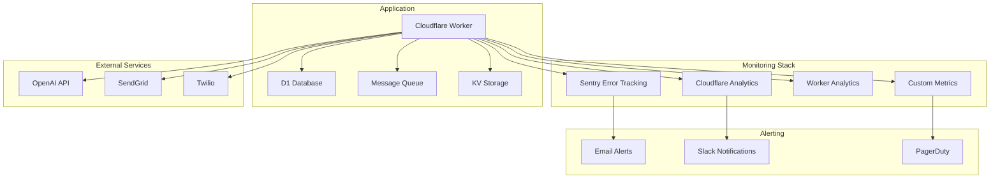

# Operations Manual

## Table of Contents
- [Overview](#overview)
- [System Monitoring](#system-monitoring)
- [Performance Management](#performance-management)
- [Security Operations](#security-operations)
- [Database Operations](#database-operations)
- [Queue Management](#queue-management)
- [Incident Response](#incident-response)
- [Maintenance Procedures](#maintenance-procedures)
- [Backup and Recovery](#backup-and-recovery)
- [Log Management](#log-management)
- [Capacity Planning](#capacity-planning)

## Overview

This operations manual provides comprehensive procedures for monitoring, maintaining, and operating the RedwoodSDK Cloudflare application in production. It covers daily operations, incident response, and maintenance tasks.

### Operational Architecture


## System Monitoring

### Health Check Endpoints

#### Application Health
```bash
# Basic health check
curl -f https://ai-concierge-mvp-prod.your-subdomain.workers.dev/health

# Expected response:
# HTTP/1.1 200 OK
# {"status": "healthy", "timestamp": "2024-01-01T10:00:00Z"}
```

#### Comprehensive Health Check
```bash
# Authenticated health check with details
curl -H "Authorization: Bearer <token>" \
     https://ai-concierge-mvp-prod.your-subdomain.workers.dev/debug/env

# Expected response:
# {
#   "environment": "prod",
#   "hasDatabase": true,
#   "user": {"email": "monitor@example.com", "role": "admin"},
#   "timestamp": "2024-01-01T10:00:00Z"
# }
```

#### Database Health
```bash
# Check database connectivity
curl -H "Authorization: Bearer <token>" \
     https://ai-concierge-mvp-prod.your-subdomain.workers.dev/debug/db-health

# Validate with direct query
wrangler d1 execute concierge_prod --remote --command "SELECT COUNT(*) as user_count FROM users;"
```

#### Queue Health
```bash
# Check queue status
curl -H "Authorization: Bearer <token>" \
     https://ai-concierge-mvp-prod.your-subdomain.workers.dev/debug/queue-status

# Expected response:
# {
#   "queueHealth": "healthy",
#   "pendingJobs": 15,
#   "processingJobs": 3,
#   "completedToday": 245,
#   "failedToday": 2
# }
```

### Performance Monitoring

#### Real-time Performance Metrics
```bash
# Get current performance metrics
curl -H "Authorization: Bearer <token>" \
     https://ai-concierge-mvp-prod.your-subdomain.workers.dev/debug/performance

# Performance headers
curl -I https://ai-concierge-mvp-prod.your-subdomain.workers.dev/draft?debug=1

# Look for Server-Timing headers:
# Server-Timing: db;dur=8.5, total;dur=45.2, queue;dur=2.1
```

#### Performance Benchmarking
```bash
# Response time benchmark
curl -w "@curl-format.txt" -s \
     https://ai-concierge-mvp-prod.your-subdomain.workers.dev/draft

# Create curl-format.txt:
cat > curl-format.txt << 'EOF'
     time_namelookup:  %{time_namelookup}\n
        time_connect:  %{time_connect}\n
     time_appconnect:  %{time_appconnect}\n
    time_pretransfer:  %{time_pretransfer}\n
       time_redirect:  %{time_redirect}\n
  time_starttransfer:  %{time_starttransfer}\n
                     ----------\n
          time_total:  %{time_total}\n
EOF
```

#### Bundle Size Monitoring
```bash
# Check build artifacts
pnpm build

# Analyze bundle size
du -sh dist/
ls -la dist/

# Check for size violations (chunks >500KB)
find dist/ -name "*.js" -size +500k -exec ls -lh {} \;
```

### Monitoring Dashboards

#### Cloudflare Analytics Dashboard
1. Navigate to Cloudflare Dashboard
2. Go to Workers & Pages → ai-concierge-mvp-prod
3. Click Analytics tab
4. Monitor:
   - Request volume
   - Response time
   - Error rate
   - Geographic distribution

#### Sentry Performance Dashboard
1. Navigate to Sentry dashboard
2. Go to Performance section
3. Monitor:
   - Transaction performance
   - Database query performance
   - Error rates and types
   - User impact metrics

### Key Performance Indicators (KPIs)

| Metric | Target | Warning | Critical | Monitoring |
|--------|--------|---------|----------|------------|
| Response Time | <50ms | >100ms | >500ms | Server-Timing headers |
| Error Rate | <0.1% | >1% | >5% | Sentry alerts |
| Uptime | >99.9% | <99.5% | <99% | Cloudflare Analytics |
| Queue Processing | <5s | >30s | >120s | Queue status endpoint |
| Database Query Time | <10ms | >50ms | >200ms | Performance monitoring |

## Performance Management

### Performance Optimization Procedures

#### Response Time Optimization
```bash
# Identify slow endpoints
curl -H "Authorization: Bearer <token>" \
     https://ai-concierge-mvp-prod.your-subdomain.workers.dev/monitoring/performance

# Check database query performance
wrangler d1 execute concierge_prod --remote --command "EXPLAIN QUERY PLAN SELECT * FROM users WHERE email = 'test@example.com';"

# Review Server-Timing headers
curl -I "https://ai-concierge-mvp-prod.your-subdomain.workers.dev/api/generate-draft" \
     -H "Authorization: Bearer <token>"
```

#### Memory Usage Optimization
```bash
# Monitor worker memory usage
wrangler tail --env prod --grep "memory"

# Check for memory leaks in logs
wrangler tail --env prod --grep "OutOfMemory"
```

#### Bundle Size Optimization
```bash
# Analyze bundle composition
pnpm build --analyze

# Check for large dependencies
npx bundle-analyzer dist/

# Remove unused dependencies
pnpm dlx depcheck
```

### Performance Tuning

#### Database Performance
```sql
-- Check slow queries
EXPLAIN QUERY PLAN SELECT * FROM audit_logs WHERE created_at > datetime('now', '-1 day');

-- Add indexes for common queries
CREATE INDEX IF NOT EXISTS idx_audit_logs_created_at ON audit_logs(created_at);
CREATE INDEX IF NOT EXISTS idx_users_email ON users(email);
CREATE INDEX IF NOT EXISTS idx_patient_briefs_doctor_id ON patient_briefs(doctor_id);
```

#### Caching Strategy
```bash
# Check cache hit rates
curl -I https://ai-concierge-mvp-prod.your-subdomain.workers.dev/static/app.js

# Verify cache headers
# Cache-Control: public, max-age=31536000, immutable
# CF-Cache-Status: HIT
```

#### Queue Optimization
```bash
# Monitor queue performance
curl -H "Authorization: Bearer <token>" \
     https://ai-concierge-mvp-prod.your-subdomain.workers.dev/debug/queue-status

# Adjust queue consumer settings in wrangler.jsonc:
# "max_batch_size": 10,     # Increase for higher throughput
# "max_batch_timeout": 30,  # Decrease for lower latency
# "max_retries": 5          # Adjust based on error rates
```

## Security Operations

### Security Monitoring

#### Real-time Security Monitoring
```bash
# Check security metrics
curl -H "Authorization: Bearer <token>" \
     https://ai-concierge-mvp-prod.your-subdomain.workers.dev/debug/security-metrics

# Monitor rate limiting status
curl -H "Authorization: Bearer <token>" \
     https://ai-concierge-mvp-prod.your-subdomain.workers.dev/debug/rate-limit-status

# Check WAF activity
# Review in Cloudflare Dashboard → Security → WAF
```

#### Security Headers Verification
```bash
# Verify security headers
curl -I https://ai-concierge-mvp-prod.your-subdomain.workers.dev/

# Expected headers:
# Strict-Transport-Security: max-age=31536000; includeSubDomains
# Content-Security-Policy: default-src 'self'; script-src 'self' 'nonce-...'
# X-Frame-Options: DENY
# X-Content-Type-Options: nosniff
# Referrer-Policy: strict-origin-when-cross-origin
```

#### Authentication Monitoring
```bash
# Monitor authentication failures
wrangler tail --env prod --grep "AUTH_FAILURE"

# Check JWT validation errors
wrangler tail --env prod --grep "JWT_ERROR"

# Monitor suspicious access patterns
wrangler tail --env prod --grep "SUSPICIOUS_ACTIVITY"
```

### Security Incident Response

#### Suspicious Activity Detection
```bash
# Monitor failed authentication attempts
curl -H "Authorization: Bearer <token>" \
     "https://ai-concierge-mvp-prod.your-subdomain.workers.dev/api/audit-logs?actionType=auth_failure&limit=100"

# Check rate limiting violations
wrangler kv:key list --namespace-id <RATE_LIMITER_ID> --prefix "blocked:"

# Review security blocklist
wrangler kv:key list --namespace-id <SECURITY_BLOCKLIST_ID>
```

#### Immediate Response Actions
```bash
# Block malicious IP address
wrangler kv:key put "blocked:192.168.1.100" "true" \
       --namespace-id <SECURITY_BLOCKLIST_ID> \
       --ttl 86400

# Temporarily increase rate limits (emergency)
wrangler secret put SECURITY_RATE_LIMIT_IP --env prod
# Enter lower value like "50" when prompted

# Emergency WAF rule activation
# Go to Cloudflare Dashboard → Security → WAF → Custom Rules
# Create blocking rule for suspicious patterns
```

#### Security Audit Procedures
```bash
# Generate security audit report
curl -H "Authorization: Bearer <token>" \
     "https://ai-concierge-mvp-prod.your-subdomain.workers.dev/api/audit-export/compliance-report" \
     -d '{"dateRange": {"start": "2024-01-01", "end": "2024-01-31"}}' \
     -o security-audit-$(date +%Y%m%d).csv

# Verify audit log integrity
curl -H "Authorization: Bearer <token>" \
     "https://ai-concierge-mvp-prod.your-subdomain.workers.dev/api/audit-export/verify-integrity" \
     -d '{"logIds": ["recent-logs"]}'
```

## Database Operations

### Database Monitoring

#### Connection Health
```bash
# Test database connectivity
wrangler d1 execute concierge_prod --remote --command "SELECT 1;"

# Check connection pool status
curl -H "Authorization: Bearer <token>" \
     https://ai-concierge-mvp-prod.your-subdomain.workers.dev/debug/db-health
```

#### Query Performance
```bash
# Monitor slow queries
wrangler d1 execute concierge_prod --remote --command "
  SELECT sql, count(*) as frequency 
  FROM sqlite_master 
  WHERE type='table';"

# Check table sizes
wrangler d1 execute concierge_prod --remote --command "
  SELECT name, 
         (SELECT COUNT(*) FROM pragma_table_info(name)) as columns,
         (SELECT COUNT(*) FROM name) as rows
  FROM sqlite_master 
  WHERE type='table';"
```

#### Database Maintenance
```bash
# Analyze database statistics
wrangler d1 execute concierge_prod --remote --command "ANALYZE;"

# Check database integrity
wrangler d1 execute concierge_prod --remote --command "PRAGMA integrity_check;"

# Vacuum database (compact)
wrangler d1 execute concierge_prod --remote --command "VACUUM;"
```

### Data Management

#### Backup Operations
```bash
# Create full database backup
wrangler d1 export concierge_prod --output "backup-$(date +%Y%m%d-%H%M%S).sql"

# Verify backup integrity
sqlite3 backup-$(date +%Y%m%d).sql ".schema" | head -20

# Store backup securely
# Upload to R2 or secure cloud storage
```

#### Data Cleanup
```bash
# Clean old audit logs (90+ days)
wrangler d1 execute concierge_prod --remote --command "
  DELETE FROM audit_logs 
  WHERE created_at < datetime('now', '-90 days');"

# Clean orphaned records
wrangler d1 execute concierge_prod --remote --command "
  DELETE FROM patient_briefs 
  WHERE doctor_id NOT IN (SELECT id FROM users);"

# Update statistics after cleanup
wrangler d1 execute concierge_prod --remote --command "ANALYZE;"
```

#### Migration Management
```bash
# Check current migration status
wrangler d1 migrations list concierge_prod

# Apply pending migrations
wrangler d1 migrations apply concierge_prod --remote

# Rollback specific migration (if needed)
wrangler d1 migrations apply concierge_prod --to 0005_migration_name
```

## Queue Management

### Queue Monitoring

#### Queue Health Checks
```bash
# Get comprehensive queue status
curl -H "Authorization: Bearer <token>" \
     https://ai-concierge-mvp-prod.your-subdomain.workers.dev/debug/queue-status

# Monitor queue consumer logs
wrangler tail --env prod --grep "QUEUE_CONSUMER"

# Check dead letter queue
wrangler queue consumer <dlq-name> --batch-size 1
```

#### Queue Performance Metrics
```bash
# Check processing times
curl -H "Authorization: Bearer <token>" \
     https://ai-concierge-mvp-prod.your-subdomain.workers.dev/monitoring/queue-metrics

# Monitor job success/failure rates
wrangler tail --env prod --grep "JOB_COMPLETED\|JOB_FAILED"
```

### Queue Operations

#### Manual Job Management
```bash
# Enqueue test job
curl -X POST -H "Authorization: Bearer <token>" \
     -H "Content-Type: application/json" \
     https://ai-concierge-mvp-prod.your-subdomain.workers.dev/api/enqueue-job \
     -d '{
       "type": "email_send",
       "messageId": "test-123",
       "recipient": "test@example.com",
       "subject": "Test Message",
       "content": "Test content"
     }'

# Purge dead letter queue (emergency)
wrangler queue consumer dlq --purge

# Restart queue processing
wrangler dev --env prod --test-scheduled
```

#### Queue Scaling
```bash
# Adjust queue consumer settings
# Edit wrangler.jsonc:
{
  "queues": {
    "consumers": [{
      "max_batch_size": 20,      # Increase for higher throughput
      "max_batch_timeout": 15,   # Decrease for lower latency
      "max_retries": 3           # Adjust based on error rates
    }]
  }
}

# Deploy changes
wrangler deploy --env prod
```

## Incident Response

### Incident Classification

| Severity | Description | Response Time | Escalation |
|----------|-------------|---------------|------------|
| P0 - Critical | Service down, data loss | 15 minutes | Immediate |
| P1 - High | Major feature broken | 1 hour | 2 hours |
| P2 - Medium | Minor feature degraded | 4 hours | 24 hours |
| P3 - Low | Cosmetic issues | 24 hours | 1 week |

### Incident Response Playbook

#### P0 Critical Incident
1. **Immediate Response (0-15 minutes)**
   ```bash
   # Check service status
   curl -f https://ai-concierge-mvp-prod.your-subdomain.workers.dev/health
   
   # Check error rates
   wrangler tail --env prod --grep "ERROR"
   
   # Initiate rollback if needed
   wrangler rollback <previous-deployment-id> --env prod
   ```

2. **Assessment (15-30 minutes)**
   ```bash
   # Gather metrics
   curl -H "Authorization: Bearer <token>" \
        https://ai-concierge-mvp-prod.your-subdomain.workers.dev/debug/performance
   
   # Check Sentry for errors
   # Review Cloudflare Analytics
   ```

3. **Resolution (30-60 minutes)**
   ```bash
   # Apply fix or rollback
   # Test in staging first if possible
   # Deploy fix to production
   wrangler deploy --env prod
   ```

#### Communication Template
```
INCIDENT ALERT [P0]
Service: AI Concierge MVP
Issue: [Brief description]
Impact: [User impact description]
Status: [Investigating/Identified/Resolving/Resolved]
ETA: [Estimated resolution time]
Updates: [Link to status page]
```

### Post-Incident Procedures

#### Post-Mortem Template
```markdown
# Incident Post-Mortem

## Summary
- **Date**: 2024-01-01
- **Duration**: 45 minutes
- **Severity**: P0 Critical
- **Impact**: 100% of users affected

## Timeline
- 10:00 - Issue detected
- 10:05 - Team notified
- 10:15 - Root cause identified
- 10:30 - Fix deployed
- 10:45 - Service restored

## Root Cause
[Detailed explanation]

## Resolution
[What was done to fix]

## Action Items
- [ ] Improve monitoring
- [ ] Add alerting
- [ ] Update runbooks
```

## Maintenance Procedures

### Scheduled Maintenance

#### Weekly Maintenance (Sundays 2:00 AM UTC)
```bash
# Database maintenance
wrangler d1 execute concierge_prod --remote --command "ANALYZE;"

# Clear expired cache entries
wrangler kv:key list --namespace-id <RATE_LIMITER_ID> --expired-only | \
  xargs -I {} wrangler kv:key delete {} --namespace-id <RATE_LIMITER_ID>

# Generate weekly performance report
curl -H "Authorization: Bearer <token>" \
     https://ai-concierge-mvp-prod.your-subdomain.workers.dev/monitoring/weekly-report
```

#### Monthly Maintenance (First Sunday 1:00 AM UTC)
```bash
# Full database backup
wrangler d1 export concierge_prod --output "monthly-backup-$(date +%Y%m).sql"

# Security audit
curl -H "Authorization: Bearer <token>" \
     "https://ai-concierge-mvp-prod.your-subdomain.workers.dev/api/audit-export/compliance-report"

# Performance baseline update
curl -H "Authorization: Bearer <token>" \
     https://ai-concierge-mvp-prod.your-subdomain.workers.dev/monitoring/baseline-update
```

#### Quarterly Maintenance
```bash
# Dependency updates
pnpm update

# Security patches
pnpm audit --fix

# Performance optimization review
pnpm build --analyze

# Capacity planning review
# Analyze growth trends and resource usage
```

### Emergency Maintenance

#### Emergency Rollback
```bash
# Quick rollback to previous version
wrangler deployments list --env prod
wrangler rollback <deployment-id> --env prod

# Verify rollback success
curl -f https://ai-concierge-mvp-prod.your-subdomain.workers.dev/health
```

#### Emergency Security Response
```bash
# Block malicious traffic
wrangler kv:key put "emergency_block:enabled" "true" \
       --namespace-id <SECURITY_BLOCKLIST_ID>

# Rotate compromised secrets
wrangler secret put WEBHOOK_SECRET --env prod
wrangler secret put OPENAI_API_KEY --env prod

# Enable additional security measures
wrangler secret put SECURITY_DDOS_THRESHOLD "500" --env prod
```

## Backup and Recovery

### Backup Strategy

#### Automated Backups
```bash
# Daily database backups (automated via cron)
0 2 * * * wrangler d1 export concierge_prod --output "daily-backup-$(date +%Y%m%d).sql"

# Weekly full backups
0 1 * * 0 wrangler d1 export concierge_prod --output "weekly-backup-$(date +%Y%m%d).sql"

# Monthly archives
0 0 1 * * wrangler d1 export concierge_prod --output "monthly-backup-$(date +%Y%m).sql"
```

#### Backup Verification
```bash
# Verify backup integrity
sqlite3 backup-$(date +%Y%m%d).sql "SELECT COUNT(*) FROM users;"

# Test restore procedure (staging)
wrangler d1 import concierge_staging backup-test.sql
```

### Recovery Procedures

#### Point-in-Time Recovery
```bash
# Restore from specific backup
wrangler d1 import concierge_prod backup-20240101-120000.sql

# Verify data integrity
wrangler d1 execute concierge_prod --remote --command "PRAGMA integrity_check;"

# Test application functionality
curl -f https://ai-concierge-mvp-prod.your-subdomain.workers.dev/health
```

#### Disaster Recovery
```bash
# Full environment recreation
# 1. Recreate D1 database
wrangler d1 create concierge_prod_recovery

# 2. Restore from backup
wrangler d1 import concierge_prod_recovery latest-backup.sql

# 3. Update configuration
# Edit wrangler.jsonc with new database ID

# 4. Deploy application
wrangler deploy --env prod

# 5. Verify recovery
curl -f https://ai-concierge-mvp-prod.your-subdomain.workers.dev/health
```

## Log Management

### Log Aggregation

#### Real-time Log Monitoring
```bash
# Monitor all logs
wrangler tail --env prod

# Filter by severity
wrangler tail --env prod --grep "ERROR\|WARN"

# Filter by component
wrangler tail --env prod --grep "DATABASE\|QUEUE\|AUTH"

# Monitor specific events
wrangler tail --env prod --grep "MESSAGE_SENT\|AUTH_FAILURE"
```

#### Log Analysis
```bash
# Search logs for patterns
wrangler tail --env prod --grep "timeout" --since 1h

# Export logs for analysis
wrangler tail --env prod --since 24h > logs-$(date +%Y%m%d).txt

# Analyze error patterns
grep "ERROR" logs-$(date +%Y%m%d).txt | sort | uniq -c | sort -nr
```

### Log Retention

#### Log Management Policy
- **Real-time logs**: 24 hours (Cloudflare Workers)
- **Error logs**: 30 days (Sentry)
- **Audit logs**: 7 years (Database)
- **Performance logs**: 90 days (Monitoring)

#### Log Cleanup
```bash
# Clean old audit logs
wrangler d1 execute concierge_prod --remote --command "
  DELETE FROM audit_logs 
  WHERE created_at < datetime('now', '-7 years');"

# Archive important logs
curl -H "Authorization: Bearer <token>" \
     "https://ai-concierge-mvp-prod.your-subdomain.workers.dev/api/audit-export?format=json&archive=true"
```

## Capacity Planning

### Resource Monitoring

#### Worker Resource Usage
```bash
# Monitor CPU utilization
wrangler tail --env prod --grep "CPU_TIME"

# Monitor memory usage
wrangler tail --env prod --grep "MEMORY"

# Check request volume
curl -H "Authorization: Bearer <token>" \
     https://ai-concierge-mvp-prod.your-subdomain.workers.dev/monitoring/request-volume
```

#### Database Capacity
```bash
# Check database size
wrangler d1 execute concierge_prod --remote --command "
  SELECT 
    page_count * page_size as size_bytes,
    page_count * page_size / 1024 / 1024 as size_mb
  FROM pragma_page_count(), pragma_page_size();"

# Monitor table growth
wrangler d1 execute concierge_prod --remote --command "
  SELECT 
    name,
    (SELECT COUNT(*) FROM name) as row_count
  FROM sqlite_master 
  WHERE type='table'
  ORDER BY row_count DESC;"
```

### Scaling Decisions

#### When to Scale Up
- **Response time** consistently > 100ms
- **Error rate** > 1%
- **Queue processing** > 30 seconds
- **Database queries** > 50ms

#### Scaling Actions
```bash
# Increase queue processing capacity
# Edit wrangler.jsonc:
"max_batch_size": 20,
"max_batch_timeout": 15

# Optimize database queries
# Add indexes for slow queries

# Enable additional caching
# Implement KV caching for frequent queries

# Consider database sharding
# Split by tenant or geographic region
```

### Growth Projections

#### Monthly Capacity Review
```bash
# Generate capacity report
curl -H "Authorization: Bearer <token>" \
     https://ai-concierge-mvp-prod.your-subdomain.workers.dev/monitoring/capacity-report

# Analyze trends
# - Request volume growth
# - Database size growth
# - Queue volume growth
# - Error rate trends
```

---

This operations manual provides comprehensive procedures for maintaining the RedwoodSDK Cloudflare application. For specific troubleshooting scenarios, refer to the [Troubleshooting Guide](./TROUBLESHOOTING.md), and for security procedures, see the [Security Documentation](./SECURITY.md).
