# Security Documentation

## Table of Contents
- [Security Overview](#security-overview)
- [Security Architecture](#security-architecture)
- [Authentication & Authorization](#authentication--authorization)
- [Security Policies](#security-policies)
- [Compliance Framework](#compliance-framework)
- [Security Monitoring](#security-monitoring)
- [Incident Response](#incident-response)
- [Security Procedures](#security-procedures)
- [Vulnerability Management](#vulnerability-management)
- [Security Checklists](#security-checklists)

## Security Overview

The RedwoodSDK Cloudflare application implements a comprehensive security framework designed for healthcare applications with HIPAA compliance requirements. The multi-layered security approach includes network protection, application security, data encryption, and continuous monitoring.

### Security Principles
- **Zero Trust Architecture**: Never trust, always verify
- **Defense in Depth**: Multiple security layers
- **Principle of Least Privilege**: Minimal required access
- **Security by Design**: Built-in security controls
- **Continuous Monitoring**: Real-time threat detection

### Compliance Standards
- **HIPAA**: Health Insurance Portability and Accountability Act
- **SOC 2 Type II**: Security and availability controls
- **ISO 27001**: Information security management
- **GDPR**: General Data Protection Regulation (where applicable)

## Security Architecture

```mermaid
graph TB
    subgraph "Network Security Layer"
        Internet[Internet Traffic]
        CF_Edge[Cloudflare Edge]
        WAF[Web Application Firewall]
        DDoS[DDoS Protection]
        Bot[Bot Management]
    end

    subgraph "Access Control Layer"
        CF_Access[Cloudflare Access]
        SAML[SAML/OIDC]
        MFA[Multi-Factor Auth]
        Device[Device Trust]
    end

    subgraph "Application Security Layer"
        Auth_MW[Authentication Middleware]
        RBAC[Role-Based Access Control]
        Rate_Limit[Rate Limiting]
        Input_Val[Input Validation]
        CSRF[CSRF Protection]
    end

    subgraph "Data Security Layer"
        Encryption[Data Encryption]
        Audit[Audit Logging]
        Backup[Secure Backups]
        Retention[Data Retention]
    end

    subgraph "Monitoring & Response"
        SIEM[Security Monitoring]
        Alerts[Real-time Alerts]
        Incident[Incident Response]
        Forensics[Digital Forensics]
    end

    Internet --> CF_Edge
    CF_Edge --> WAF
    WAF --> DDoS
    DDoS --> Bot
    Bot --> CF_Access

    CF_Access --> SAML
    SAML --> MFA
    MFA --> Device
    Device --> Auth_MW

    Auth_MW --> RBAC
    RBAC --> Rate_Limit
    Rate_Limit --> Input_Val
    Input_Val --> CSRF

    CSRF --> Encryption
    Encryption --> Audit
    Audit --> Backup
    Backup --> Retention

    Retention --> SIEM
    SIEM --> Alerts
    Alerts --> Incident
    Incident --> Forensics
```



## Authentication & Authorization

### Zero Trust Authentication

The application uses Cloudflare Access for Zero Trust authentication with the following components:

#### Identity Providers
- **SAML 2.0**: Enterprise SSO integration
- **OIDC**: Modern authentication standard
- **Azure AD**: Microsoft identity platform
- **Google Workspace**: Google identity provider
- **Multi-Factor Authentication**: Required for all users

#### JWT Token Validation
```typescript
// JWT validation process
const validateJWT = async (token: string) => {
  // 1. Verify token signature with Cloudflare public keys
  const publicKeys = await fetchCloudflareKeys();
  const isValid = await verifySignature(token, publicKeys);
  
  // 2. Validate token claims
  const claims = decodeToken(token);
  validateClaims(claims, {
    issuer: env.CLOUDFLARE_ACCESS_DOMAIN,
    audience: env.CLOUDFLARE_ACCESS_AUD,
    expiration: true
  });
  
  // 3. Check token in cache/database
  const user = await findOrCreateUser(claims);
  return { isValid, user };
};
```

### Role-Based Access Control (RBAC)

#### User Roles
| Role | Permissions | Description |
|------|-------------|-------------|
| `auditor` | Read-only audit logs, compliance reports | Security and compliance monitoring |
| `staff` | Basic draft generation (50/day limit) | Healthcare staff with limited access |
| `reviewer` | Review and approve messages | Quality assurance reviewers |
| `doctor` | Full patient workflows (100/day limit) | Licensed healthcare providers |
| `admin` | Administrative access (1000/day limit) | System administrators |

#### Permission Matrix
```typescript
const permissions = {
  'auditor': [
    'audit_logs:read',
    'compliance_reports:read',
    'system_metrics:read'
  ],
  'staff': [
    'draft:generate',
    'patient_inquiry:read',
    'patient_inquiry:update'
  ],
  'reviewer': [
    'message:review',
    'message:approve',
    'message:reject',
    'draft:generate'
  ],
  'doctor': [
    'patient:full_access',
    'message:send_directly',
    'settings:update',
    'draft:generate'
  ],
  'admin': [
    'system:admin',
    'users:manage',
    'audit_logs:full_access',
    'settings:system_wide'
  ]
};
```

### Session Management

#### JWT Token Security
- **Short-lived tokens**: 8-hour expiration
- **Secure transmission**: HTTPS only
- **Token refresh**: Automatic renewal
- **Revocation**: Immediate invalidation support

#### Session Security Controls
```typescript
const sessionSecurity = {
  tokenExpiration: '8h',
  refreshWindow: '1h',
  maxConcurrentSessions: 3,
  ipBinding: true,
  deviceFingerprinting: true,
  automaticLogout: '24h_inactivity'
};
```

## Security Policies

### Content Security Policy (CSP)

```http
Content-Security-Policy: 
  default-src 'self';
  script-src 'self' 'nonce-{nonce}' https://browser.sentry-cdn.com;
  style-src 'self' 'unsafe-inline';
  img-src 'self' data: https:;
  font-src 'self' https://fonts.gstatic.com;
  connect-src 'self' https://api.sentry.io;
  frame-ancestors 'none';
  form-action 'self';
  base-uri 'self';
  report-uri /security/csp-report;
```

### Security Headers

```http
# Strict Transport Security
Strict-Transport-Security: max-age=31536000; includeSubDomains; preload

# Frame Protection
X-Frame-Options: DENY
Content-Security-Policy: frame-ancestors 'none'

# Content Type Protection
X-Content-Type-Options: nosniff

# XSS Protection
X-XSS-Protection: 1; mode=block

# Referrer Policy
Referrer-Policy: strict-origin-when-cross-origin

# Permissions Policy
Permissions-Policy: 
  camera=(), 
  microphone=(), 
  geolocation=(), 
  payment=()
```

### Rate Limiting Policy

```typescript
const rateLimits = {
  // IP-based limits
  ip: {
    requests: 100,
    window: '1m',
    burst: 150
  },
  
  // User-based limits
  user: {
    requests: 500,
    window: '1m',
    burst: 750
  },
  
  // API-specific limits
  api: {
    'generate-draft': {
      staff: { requests: 50, window: '1d' },
      doctor: { requests: 100, window: '1d' },
      admin: { requests: 1000, window: '1d' }
    }
  }
};
```

## Compliance Framework

### HIPAA Compliance

#### Administrative Safeguards
- **Security Officer**: Designated security responsibility
- **Workforce Training**: Regular security awareness training
- **Access Management**: User access controls and reviews
- **Incident Procedures**: Security incident response plan
- **Business Associates**: Third-party security agreements

#### Physical Safeguards
- **Facility Access**: Cloudflare data center security
- **Workstation Use**: Secure development environments
- **Device Controls**: Hardware and software inventory
- **Media Controls**: Secure data disposal procedures

#### Technical Safeguards
- **Access Control**: Unique user identification and authentication
- **Audit Controls**: Comprehensive logging and monitoring
- **Integrity**: Data alteration and destruction protection
- **Transmission Security**: End-to-end encryption
- **Encryption**: Data at rest and in transit protection

### Data Protection Controls

#### Data Classification
```typescript
const dataClassification = {
  'public': {
    encryption: 'optional',
    retention: 'indefinite',
    access: 'unrestricted'
  },
  'internal': {
    encryption: 'required',
    retention: '7_years',
    access: 'authenticated_users'
  },
  'confidential': {
    encryption: 'required_strong',
    retention: '7_years',
    access: 'role_based'
  },
  'restricted': {
    encryption: 'required_strongest',
    retention: '7_years',
    access: 'admin_only'
  }
};
```

#### Encryption Standards
- **Data at Rest**: AES-256 encryption
- **Data in Transit**: TLS 1.3 minimum
- **Key Management**: Cloudflare managed keys
- **Backup Encryption**: Full backup encryption
- **Database Encryption**: Transparent data encryption

### Audit Requirements

#### Audit Log Standards
```typescript
const auditLogFormat = {
  timestamp: 'ISO8601',
  userId: 'string',
  userRole: 'string',
  actionType: 'enum',
  resourceType: 'string',
  resourceId: 'string',
  ipAddress: 'string',
  userAgent: 'string',
  outcome: 'success|failure',
  details: 'object'
};
```

#### Audit Trail Requirements
- **Comprehensive Logging**: All user actions logged
- **Immutable Records**: Tamper-proof audit logs
- **Long-term Retention**: 7-year minimum retention
- **Access Controls**: Restricted audit log access
- **Regular Reviews**: Monthly audit log analysis

## Security Monitoring

### Real-time Monitoring

#### Security Metrics Dashboard
```bash
# Security metrics endpoint
curl -H "Authorization: Bearer <token>" \
     https://ai-concierge-mvp-prod.your-subdomain.workers.dev/monitoring/security

# Expected metrics:
{
  "authentication": {
    "successRate": 99.8,
    "failureCount": 12,
    "suspiciousAttempts": 2
  },
  "authorization": {
    "accessDenied": 5,
    "privilegeEscalation": 0,
    "roleViolations": 1
  },
  "network": {
    "blockedIPs": 25,
    "wafBlocks": 145,
    "ddosAttempts": 0
  }
}
```

#### Threat Detection
```typescript
const threatDetection = {
  // Authentication anomalies
  multipleFailedLogins: {
    threshold: 5,
    window: '5m',
    action: 'block_ip'
  },
  
  // Access pattern anomalies
  unusualAccess: {
    newLocation: 'alert',
    newDevice: 'challenge',
    offHours: 'log'
  },
  
  // Data access anomalies
  massDataAccess: {
    threshold: 100,
    window: '1h',
    action: 'alert_admin'
  }
};
```

### Security Alerting

#### Alert Classifications
| Severity | Response Time | Escalation | Examples |
|----------|---------------|------------|-----------|
| Critical | 5 minutes | Immediate | Authentication bypass, data breach |
| High | 15 minutes | 1 hour | Multiple failed logins, privilege escalation |
| Medium | 1 hour | 4 hours | Unusual access patterns, policy violations |
| Low | 4 hours | 24 hours | Minor security events, informational |

#### Alert Channels
```yaml
alerting:
  channels:
    email:
      - security-team@company.com
      - admin@company.com
    slack:
      webhook: "https://hooks.slack.com/services/..."
      channel: "#security-alerts"
    pagerduty:
      service_key: "critical-security-incidents"
    sentry:
      dsn: "https://sentry.io/projects/..."
```

## Incident Response

### Security Incident Classification

#### Incident Types
- **Data Breach**: Unauthorized access to sensitive data
- **Authentication Bypass**: Circumvention of access controls
- **Privilege Escalation**: Unauthorized permission elevation
- **Malware/Injection**: Code injection or malicious software
- **Denial of Service**: Service availability attacks
- **Insider Threat**: Malicious internal activity

### Incident Response Procedures

#### Immediate Response (0-30 minutes)
```bash
# 1. Contain the threat
wrangler kv:key put "security_lockdown:enabled" "true" \
       --namespace-id <SECURITY_BLOCKLIST_ID>

# 2. Block suspicious IPs
wrangler kv:key put "blocked:192.168.1.100" "true" \
       --namespace-id <SECURITY_BLOCKLIST_ID>

# 3. Rotate compromised credentials
wrangler secret put WEBHOOK_SECRET --env prod
wrangler secret put OPENAI_API_KEY --env prod

# 4. Enable enhanced monitoring
wrangler secret put SECURITY_ENHANCED_MONITORING "true" --env prod

# 5. Generate incident report
curl -H "Authorization: Bearer <token>" \
     "https://ai-concierge-mvp-prod.your-subdomain.workers.dev/api/audit-export/security-incident" \
     -o "incident-$(date +%Y%m%d-%H%M%S).json"
```

#### Investigation Phase (30 minutes - 2 hours)
```bash
# Gather forensic evidence
curl -H "Authorization: Bearer <token>" \
     "https://ai-concierge-mvp-prod.your-subdomain.workers.dev/api/audit-logs" \
     -d '{"startDate": "2024-01-01T00:00:00Z", "limit": 1000}' \
     > incident-audit-logs.json

# Analyze access patterns
wrangler tail --env prod --since 24h > incident-logs.txt

# Check data integrity
wrangler d1 execute concierge_prod --remote --command "PRAGMA integrity_check;"
```

#### Recovery Phase (2-24 hours)
```bash
# Implement fixes
# - Patch vulnerabilities
# - Update security controls
# - Enhance monitoring

# Verify security posture
curl -H "Authorization: Bearer <token>" \
     https://ai-concierge-mvp-prod.your-subdomain.workers.dev/security/posture-check

# Restore normal operations
wrangler kv:key delete "security_lockdown:enabled" \
       --namespace-id <SECURITY_BLOCKLIST_ID>
```

### Communication Templates

#### Security Incident Notification
```
SECURITY INCIDENT ALERT [SEVERITY]

Incident ID: INC-2024-001
Date/Time: 2024-01-01 10:00:00 UTC
Severity: Critical/High/Medium/Low
Status: Detected/Investigating/Contained/Resolved

Summary:
[Brief description of the incident]

Impact:
[Description of affected systems/users/data]

Actions Taken:
- [List of immediate actions]
- [List of containment measures]

Next Steps:
- [Planned investigation activities]
- [Recovery procedures]

Contact:
Security Team: security@company.com
On-call: +1-555-SECURITY
```

## Security Procedures

### Regular Security Tasks

#### Daily Security Checks
```bash
# 1. Review security metrics
curl -H "Authorization: Bearer <token>" \
     https://ai-concierge-mvp-prod.your-subdomain.workers.dev/monitoring/security-daily

# 2. Check authentication failures
curl -H "Authorization: Bearer <token>" \
     "https://ai-concierge-mvp-prod.your-subdomain.workers.dev/api/audit-logs?actionType=auth_failure&limit=50"

# 3. Monitor blocked IPs
wrangler kv:key list --namespace-id <SECURITY_BLOCKLIST_ID>

# 4. Verify security headers
curl -I https://ai-concierge-mvp-prod.your-subdomain.workers.dev/
```

#### Weekly Security Reviews
```bash
# 1. Comprehensive audit log review
curl -H "Authorization: Bearer <token>" \
     "https://ai-concierge-mvp-prod.your-subdomain.workers.dev/api/audit-export" \
     -d '{"startDate": "2024-01-01", "endDate": "2024-01-07"}' \
     > weekly-audit-review.csv

# 2. Security posture assessment
curl -H "Authorization: Bearer <token>" \
     https://ai-concierge-mvp-prod.your-subdomain.workers.dev/security/posture-assessment

# 3. User access review
wrangler d1 execute concierge_prod --remote --command "
  SELECT email, role, last_login_at FROM users 
  WHERE last_login_at > datetime('now', '-7 days');"

# 4. Vulnerability scan
pnpm audit --audit-level moderate
```

#### Monthly Security Activities
```bash
# 1. Comprehensive security report
curl -H "Authorization: Bearer <token>" \
     "https://ai-concierge-mvp-prod.your-subdomain.workers.dev/api/audit-export/compliance-report"

# 2. Penetration testing
# Schedule external security assessment

# 3. Security training
# Conduct security awareness training

# 4. Business continuity testing
# Test incident response procedures
```

### Secret Management

#### Secret Rotation Schedule
```yaml
rotation_schedule:
  webhook_secrets: 30_days
  api_keys: 90_days
  certificates: 365_days
  admin_passwords: 90_days
```

#### Secret Rotation Process
```bash
# 1. Generate new secret
NEW_SECRET=$(openssl rand -base64 32)

# 2. Update in staging first
wrangler secret put WEBHOOK_SECRET --env staging
echo "$NEW_SECRET" | wrangler secret put WEBHOOK_SECRET --env staging

# 3. Test staging functionality
curl -X POST https://ai-concierge-mvp-staging.workers.dev/webhook/test \
     -H "X-Webhook-Signature: $(echo -n "test" | openssl dgst -sha256 -hmac "$NEW_SECRET")"

# 4. Update production
echo "$NEW_SECRET" | wrangler secret put WEBHOOK_SECRET --env prod

# 5. Verify production functionality
curl -f https://ai-concierge-mvp-prod.your-subdomain.workers.dev/debug/webhook-config
```

## Vulnerability Management

### Vulnerability Assessment

#### Automated Scanning
```bash
# Dependency vulnerability scanning
pnpm audit --audit-level moderate

# Container scanning (if applicable)
docker scan cloudflare/workers:latest

# Infrastructure scanning
# Use Cloudflare security scanning tools
```

#### Manual Security Testing
```bash
# API security testing
# Test authentication bypass
curl -H "Authorization: Bearer invalid-token" \
     https://ai-concierge-mvp-prod.your-subdomain.workers.dev/api/admin-only

# Test injection attacks
curl -X POST https://ai-concierge-mvp-prod.your-subdomain.workers.dev/api/generate-draft \
     -H "Authorization: Bearer <token>" \
     -d '{"patientInquiry": "'; DROP TABLE users; --"}'

# Test rate limiting
for i in {1..200}; do
  curl https://ai-concierge-mvp-prod.your-subdomain.workers.dev/health
done
```

### Patch Management

#### Critical Vulnerability Response
```bash
# 1. Assess vulnerability impact
npm audit --json | jq '.vulnerabilities'

# 2. Apply security patches
pnpm update --latest

# 3. Test in staging
pnpm build && wrangler deploy --env staging

# 4. Deploy to production
pnpm build && wrangler deploy --env prod

# 5. Verify fix
pnpm audit --audit-level high
```

## Security Checklists

### Pre-Deployment Security Checklist

- [ ] Security headers configured
- [ ] Authentication mechanisms tested
- [ ] Authorization controls verified
- [ ] Input validation implemented
- [ ] Rate limiting configured
- [ ] Audit logging enabled
- [ ] Encryption properly implemented
- [ ] Secrets securely managed
- [ ] Vulnerability scanning completed
- [ ] Security testing performed

### Monthly Security Review Checklist

- [ ] User access review completed
- [ ] Audit logs analyzed
- [ ] Security metrics reviewed
- [ ] Vulnerability scans performed
- [ ] Penetration testing scheduled
- [ ] Incident response procedures tested
- [ ] Security training conducted
- [ ] Compliance requirements verified
- [ ] Backup security verified
- [ ] Disaster recovery tested

### Incident Response Checklist

- [ ] Incident detected and classified
- [ ] Security team notified
- [ ] Immediate containment actions taken
- [ ] Evidence collection initiated
- [ ] Stakeholders informed
- [ ] Investigation procedures followed
- [ ] Recovery plan executed
- [ ] Lessons learned documented
- [ ] Preventive measures implemented
- [ ] Post-incident review completed

---

This security documentation provides comprehensive guidelines for maintaining the security posture of the RedwoodSDK Cloudflare application. Regular reviews and updates ensure continued effectiveness against evolving threats.

For security emergencies, contact: security@company.com or +1-555-SECURITY
